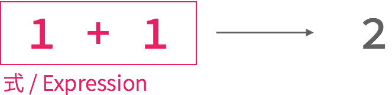

# 情報基礎2\#1

慶應義塾大学環境情報学部
清水智公 (chiko@tom.sfc.keio.ac.jp)

---

## この講義の目的

* 作り手になろう
* プログラミングは、最も簡単な生産方法の1つ
* Webは、最もお手軽なプログラミング環境の1つ

----

## 採点の要素

* 中間試験（第7回に予定）
* 最終発表と成果物
* 日々の講義への貢献

----

## 休講と補講の予定

日時|内容|メモ
---|---|--
2015/11/04|休講|
2015/12/10|休講|
2016/01/16|補講|2,3,4,5 限に補講をします

----

## 担当教員：清水智公

<ul>
<liしみずのりただ / [@chikoski](https://twitter.com/chikoski)</li>
<li>SFC歴 18年目</li>
<li>[Mozilla Japan](http://www.mozilla.jp)</li>
<li>プログラミング言語、機械学習</li>
</ul>

---

## 今日の内容

* 環境の作成
* GitHubの練習
* JavaScriptの復習

---

## 環境を作ろう

* [Firefox Developer Edition](https://www.mozilla.org/firefox/developer/)のインストール
* [Atom](https://atom.io/)のインストール
* [Github](https://github.com/)へのサインイン
* [Github Desktop](https://desktop.github.com/)のインストール
* [Cisco Spark](http://www.webex.com/ciscospark/)へのサインイン

----

## アカウントを教えてください → [http://goo.gl/b2dJm9](http://goo.gl/b2dJm9)

---

## Github

* バージョン管理システム
* コラボレーション支援
* タスク管理、活動の可視化もできる

----

## どのファイルが最新？

* index.html
* index_new.html
* index (old).html
* index_20150920.html
* index_2015092001.html
* index.html（最新）
* index.html（ほんとの最新）

----

## そこでバージョン管理

----

## GitHubの操作

* レポジトリの作成 (create)
* 手元へのクローン (clone)
* 履歴の保存 (commit)
* 履歴の送信 (push)

----

----

----

----

---

## 初めてのClone

1. ronpro2015f の lecture01 というレポジトリをクローンする
2. "xxx_working_branch" というブランチを作成
    * xxxを自分のアカウントに置き換えること
    * 作成方法については後述する
3. クローンしたレポジトリを Finder / Explorer で表示する

----

### クローン方法

----

### ブランチの作成

----

### Finder でのレポジトリの表示

---

## GitHubの操作：ファイルの変更を破棄

1. index.html を削除
2. GitHub Desktop を表示
3. index.html の上で右クリック
4. "Discard Changes" を選ぶ
5. Finder / Explorer で、ファイルが復活していることを確認する

----

### ファイル削除後の GitHub Desktop

----

### 変更の破棄

---

## GitHubの操作：コミット

1. レポジトリに自分のアカウント名でフォルダを作る
2. index.html と js フォルダをコピーする
3. GitHub Desktop で変更をコミットする

----

### ファイルコピー後の状態

----

### 変更のコミット

----

#### 練習問題1：変更とコミットに慣れる

* JavaScript について知っている単語を、コピーした index.html に書く
     * 聞いたことある、レベルの単語でも書く
     * 意味がわかる場合は、意味の解説も書くと良い
* こまめにコミットを行う

---

## Pull request：課題の提出

----

### 送信された pull request

Web 上で閲覧可能であることに留意すること

---

## 対話的な JavaScript の実行

1. コピーした index.html を Firefox で表示
2. 「ツール」→「開発ツール」→「コンソールの表示」を選ぶ
3. コンソールに JavaScript を入力して、対話的に実行する

----

### コンソールの表示

----

### コンソールで次を実行する

~~~javascript
1 + 2
3 * 5
1 * 2 * 3 + 4
10 % 7
86418 % 7
Number.POSITIVE_INFINITY * 2
Number.POSITIVE_INFINITY + Number.NEGATIVE_INFINITY
Number.MAX_VALUE
Number.MAX_VALUE + 1
~~~

----

#### 式と評価

----

#### 式と評価（つづき）

----

#### 式と評価（つづき）

----

#### 算術演算子

|演算子|役割|例|評価値|
|----|---|--|----|
|+|二つの値の足し算|3.14+1|4.14|
|-|二つの値の引き算|3.14-1|2.14|
|*|二つの値の掛け算|3.14*2|6.28|
|/|二つの値の割り算|3.14/2|1.57|
|%|二つの値の割り算の、あまり|10%3|1|

---

## 関数の呼び出し

~~~javascript
add(1, 2)
add(1, 2) + 1
add(1, add(2, 3)) + 4
add(add(1, 2), add(3, 4)) + 5
~~~

----

----

----

### より複雑な関数の呼び出し

~~~javascript
divide(1, Math.exp(multiply(add(multiply(2, 4), 1), -1)) + 1)
~~~

この関数を計算している：

---

## 変数：計算の途中経過の記憶

~~~javascript
var ix = multiply(2, 4);
var x = add(ix, 1);
var denominator = add(multiply(x, -1), 1);
divide(1, denominator);
~~~

----

### 変数名の宣言

~~~javascript
var a;
var b, c, d;
var e = 10;
~~~

* 記号を変数と明示するため
* カンマ (,) で区切って、複数の変数を1文で宣言できる
* 変数の宣言と、代入を1文で行える

----

### 代入：変数と値の結びつけ

----

### 参照：文の中で変数を利用すること

~~~javascript
var a = 1;
var b = 2;
var c = a + b;
var ix = multiply(a, c);
var x = add(ix, b);
var denominator = add(multiply(x, -1), a);
divide(1, denominator);
~~~

---

## 関数定義

~~~javascript
function sigmoid(value, gain){
  gain = multiply(gain, -1);
  value = multiply(value, gain);
  var denominator = 1 + Math.exp(value);
  return divide(1, denominator);
}

var a = sigmoid(0, 1);
var b = sigmoid(1, 2);
var c = sigmoid(2 * 4 + 1, 1);
~~~

* プログラムの部分をまとめること
* 多くの場合は、まとめた部分に対して名前をつける
* プログラム作成の効率化、処理の抽象化、可読性の向上

----

### 仮引数

~~~javascript
function sigmoid(value, gain){
  gain = multiply(gain, -1);
  value = multiply(value, gain);
  var denominator = 1 + Math.exp(value);
  return divide(1, denominator);
}
~~~

* 関数定義時には、引数の値は未定
* 計算に利用するため、引数をそれぞれ変数（仮引数）として表現
* 関数定義時に()へ列挙することで、仮引数を宣言できる

----

### 実引数

~~~javascript
function sigmoid(value, gain){
  gain = multiply(gain, -1);
  value = multiply(value, gain);
  var denominator = 1 + Math.exp(value);
  return divide(1, denominator);
}

var a = sigmoid(0, 1);
~~~

* 関数呼び出し時に、引数の値は決定される
* 値が決定した引数を実引数と呼ぶ
* 上記の例では0と1が value と gain に代入され計算が行われる

----

### 返り値

~~~javascript
function increment(value){
  return value + 1;
}

var a = increment(10); //11が代入される
var b = increment(1); // 2 が代入される
~~~

* 返り値：関数の評価値
* 何を評価値とするかは、プログラマが明示する
* return 文を使うと、そのあとの式の評価値が関数の返り値となる

----

### 返り値（つづき）

~~~javascript
function add(a, b){
  return a + b;
  // この行以降は実行されない
  var c = a + b;
  var d = c + c;
  return a + b + c + d;
}
~~~

* return 文を実行すると、その関数内の処理を終了する
* 複数の値を、関数の返り値にはできない
* 複数の値を返したい場合は、Objectとして1つにまとめる必要がある

---

## 練習問題2

~~~javascript
(1 * 2 + 3 * 4) % 5
~~~
これを以下の関数を適切に組み合わせて、書き直せ。

|関数|役割|例|返り値|
|---|---|-|-----|
|add|足し算|add(1, 2)|3|
|subtract|引き算|subtract(3, 2)|1|
|multiply|掛け算|multiply(3, 7)|21|
|divide|割り算|divide(10, 2)|5|
|mod|剰余|mod(10, 7)|3|

---

## 変数のスコープ

~~~javascript
var a = 10;
var b = 2;
var c = 0;

function someFunc(a){
  var c = 10;
  return b * a + c;
}

var d = someFunc(5);
~~~

* d には何が代入されるだろうか？
* 関数呼び出し終了時に、c には何が代入されているだろうか？

----

### 変数のスコープ（つづき）

~~~javascript
var a = 10;
var b = 2;
var c = 0;

function someFunc(a){
  var c = 10;
  return b * a + c;
}

var d = someFunc(5);
~~~

* 関数内でも変数を宣言できる
* 関数内と関数外で同名の変数が宣言されている場合、参照時に関数内のものが利用される
* 関数内で宣言した変数（仮引数も含む）は、関数外で参照できない

---

## 練習問題3

* 引数に指定された長さを半径とする円の、円周を返す関数Rを定義せよ
* Math.PI　を参照すると、円周率が得られる
* 関数定義は、js/numeric_functions.js に記述すること
* 記述したらGitHubにコミットすること

---

## 練習問題4

* 引数に指定された長さを半径とする円の面積を計算する関数を定義せよ
* 定義する関数の名前は自分で決定すること
* Math.PI　を参照すると、円周率が得られる
* 関数定義は、js/numeric_functions.js に記述すること
* 記述したらGitHubにコミットすること

---

### 練習問題5

* 引数に指定された3つの数値を基に、円の面積を計算し、最も大きい面積を返す関数を定義せよ
* 関数名は自分で決定すること
* Math.PI　を参照すると、円周率が得られる
* Math.max は、2つの引数のうち大きい方の値を返す関数である
* 関数定義は、js/numeric_functions.js に記述すること
* 記述したらGitHubにコミットすること

~~~javascript
var a = Math.max(0, 1); // 1 が代入される
var b = Math.max(-100, 100); // 100 が代入される
var c = Math.max(12345, 1); // 12345 が代入される
~~~

---

### 練習問題6

* pull request を作成し、送信すること
* 送信の方法は[こちらのスライド](#/8)を参照すること
