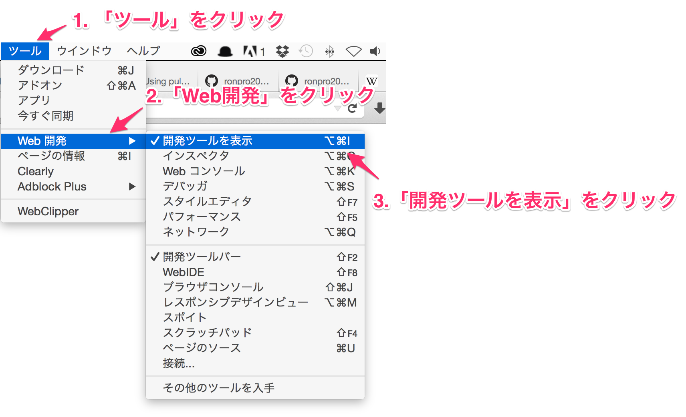
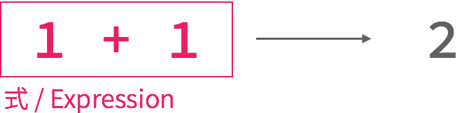
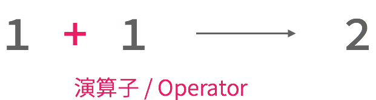
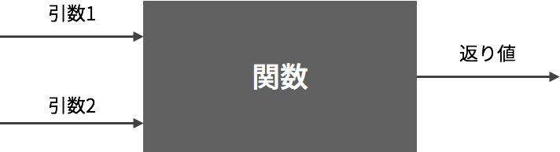
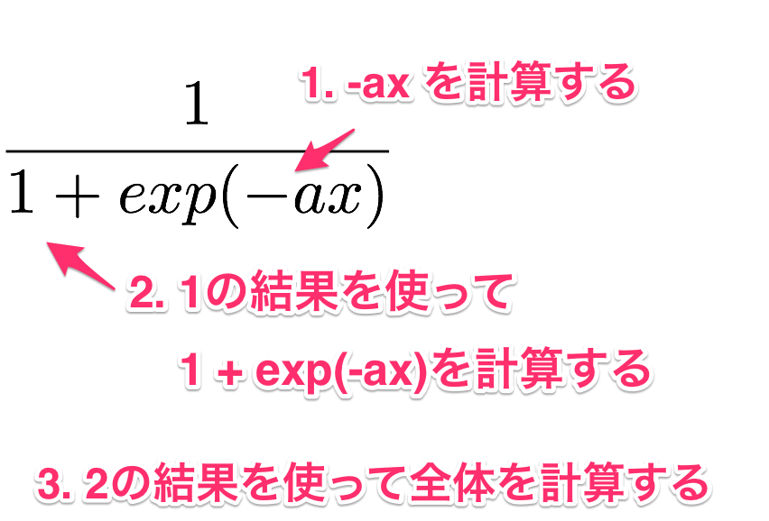
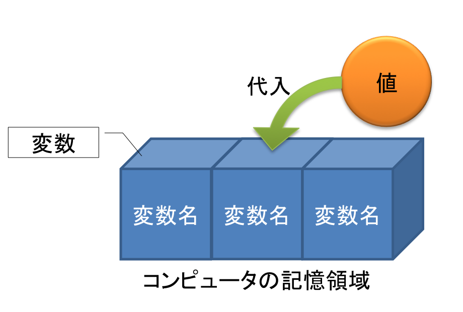

# 情報基礎2\#02

慶應義塾大学環境情報学部
清水智公 (chiko@tom.sfc.keio.ac.jp)

---

## 前回の内容

* [環境設定](../01/#/3)
* [GitHub入門](../01/#/4)
* [Pull Request による課題の提出](../01/#/4)

---

## fork

* 既存のレポジトリをコピーして、新しいレポジトリを作ること
* 履歴を分岐させるので "fork"

----

### GitHub 上での操作

----

### fork をする場面

* 既存資産を生かして、新しいプロジェクトを始めるため
* 安全に開発を行うための作業領域を作成するため

----

### 課題提出方法

1. 提出先のレポジトリを fork
2. 1 で作成したレポジトリをクローン
3. 2 でクローンしたレポジトリにに、作業用の branch を作成
4. 課題を作成
5. 4 の作業内容をコミット
6. fork 元のレポジトリに対して pull request を作成

---

## 練習問題 1

1. [ex02-1](https://github.com/ronpro2015f/ex02-1/) のレポジトリを fork せよ
2. 1 で作成したレポジトリに、ex02-working-branch というブランチを作成せよ
3. list.md に、GitHub アカウントを追記せよ
4. 追記したら、コミットを行い pull request を送信せよ

---

## 今日の内容

~~~javascript
function succ(n){
  var result = n + 1;
  return result;
}

var zero = 0;
var one = succ(zero);
var two = succ(one);
var three = succ(succ(succ(zero)));
~~~

---

## サンプルコードの入手

1. [このレポジトリ](https://github.com/ronpro2015f/02/) を fork する
2. 1 で作成したレポジトリを clone する
3. clone したら "xxx_working_branch" というブランチを作成する
4. clone した index.html を Firefox で表示する

---

## コンソールの表示

---

## コンソールで次を実行する

~~~javascript
1 + 2
3 * 5
1 * 2 * 3 + 4
10 % 7
86418 % 7
Number.POSITIVE_INFINITY * 2
Number.POSITIVE_INFINITY + Number.NEGATIVE_INFINITY
Number.MAX_VALUE
Number.MAX_VALUE + 1
~~~

----

### 式と評価

----

### 式と評価（つづき）

----

### 式と評価（つづき）

----

#### 算術演算子

|演算子|役割|例|評価値|
|----|---|--|----|
|+|二つの値の足し算|3.14+1|4.14|
|-|二つの値の引き算|3.14-1|2.14|
|*|二つの値の掛け算|3.14*2|6.28|
|/|二つの値の割り算|3.14/2|1.57|
|%|二つの値の割り算の、あまり|10%3|1|

---

## 関数の呼び出し

~~~javascript
add(1, 2)
add(1, 2) + 1
add(1, add(2, 3)) + 4
add(add(1, 2), add(3, 4)) + 5
~~~

----

----

----

### より複雑な関数の呼び出し

~~~javascript
divide(1, Math.exp(multiply(0.7, -1)) + 1)
~~~

----

### 先ほどの関数の計算

----

---

## 変数：計算の途中経過の記憶

~~~javascript
var x = 0.7;
var minusX = multiply(0.7, -1);
var exp = Math.exp(minusX);
var denominator = add(1, exp);
divide(1, denominator);
~~~

----

### 変数名の宣言

~~~javascript
var a;
var b, c, d;
var e = 10;
~~~

* 記号を変数と明示するため
* カンマ (,) で区切って、複数の変数を1文で宣言できる
* 変数の宣言と、代入を1文で行える

----

### 代入：変数と値の結びつけ

----

### 参照：文の中で変数を利用すること

~~~javascript
var a = 1;
var b = 2;
var c = a + b;
var ix = multiply(a, c);
var x = add(ix, b);
var denominator = add(multiply(x, -1), a);
divide(1, denominator);
~~~

---

## 関数定義

~~~javascript
function sigmoid(value, gain){
  gain = multiply(gain, -1);
  value = multiply(value, gain);
  var denominator = 1 + Math.exp(value);
  return divide(1, denominator);
}

var a = sigmoid(0, 1);
var b = sigmoid(1, 2);
var c = sigmoid(2 * 4 + 1, 1);
~~~

* プログラムの部分をまとめること
* 多くの場合は、まとめた部分に対して名前をつける
* プログラム作成の効率化、処理の抽象化、可読性の向上

----

### 仮引数

~~~javascript
function sigmoid(value, gain){
  gain = multiply(gain, -1);
  value = multiply(value, gain);
  var denominator = 1 + Math.exp(value);
  return divide(1, denominator);
}
~~~

* 関数定義時には、引数の値は未定
* 計算に利用するため、引数をそれぞれ変数（仮引数）として表現
* 関数定義時に()へ列挙することで、仮引数を宣言できる

----

### 実引数

~~~javascript
function sigmoid(value, gain){
  gain = multiply(gain, -1);
  value = multiply(value, gain);
  var denominator = 1 + Math.exp(value);
  return divide(1, denominator);
}

var a = sigmoid(0, 1);
~~~

* 関数呼び出し時に、引数の値は決定される
* 値が決定した引数を実引数と呼ぶ
* 上記の例では0と1が value と gain に代入され計算が行われる

----

### 返り値

~~~javascript
function increment(value){
  return value + 1;
}

var a = increment(10); //11が代入される
var b = increment(1); // 2 が代入される
~~~

* 返り値：関数の評価値
* 何を評価値とするかは、プログラマが明示する
* return 文を使うと、そのあとの式の評価値が関数の返り値となる

----

### 返り値（つづき）

~~~javascript
function add(a, b){
  return a + b;
  // この行以降は実行されない
  var c = a + b;
  var d = c + c;
  return a + b + c + d;
}
~~~

* return 文を実行すると、その関数内の処理を終了する
* 複数の値を、関数の返り値にはできない
* 複数の値を返したい場合は、Objectとして1つにまとめる必要がある

---

## 練習問題 2

~~~javascript
(1 * 2 + 3 * 4) % 5
~~~

これを以下の関数を適切に組み合わせて、書き直せ。

|関数|役割|例|返り値|
|---|---|-|-----|
|add|足し算|add(1, 2)|3|
|subtract|引き算|subtract(3, 2)|1|
|multiply|掛け算|multiply(3, 7)|21|
|divide|割り算|divide(10, 2)|5|
|mod|剰余|mod(10, 7)|3|

---

## 変数のスコープ

~~~javascript
var a = 10;
var b = 2;
var c = 0;

function someFunc(a){
  var c = 10;
  return b * a + c;
}

var d = someFunc(5);
~~~

* d には何が代入されるだろうか？
* 関数呼び出し終了時に、c には何が代入されているだろうか？

----

### 変数のスコープ（つづき）

~~~javascript
var a = 10;
var b = 2;
var c = 0;

function someFunc(a){
  var c = 10;
  return b * a + c;
}

var d = someFunc(5);
~~~

* 関数内でも変数を宣言できる
* 関数内と関数外で同名の変数が宣言されている場合、参照時に関数内のものが利用される
* 関数内で宣言した変数（仮引数も含む）は、関数外で参照できない

---

## 練習問題 3

* 引数に指定された長さを半径とする円の、円周を返す関数 circumfercence を定義せよ
* Math.PI　を参照すると、円周率が得られる
* 関数定義は、js/circumference.js に記述すること
* 記述したらコミットすること

---

## 練習問題 4

* 引数に指定された長さを半径とする円の面積を計算する関数 circleArea を定義せよ
* Math.PI　を参照すると、円周率が得られる
* 関数定義は、js/circle_area.js に記述すること
* 記述したらコミットすること

---

## 練習問題 5

* 引数に指定された3つの数値を基に、円の面積を計算し、最も大きい面積を返す関数を定義せよ
* 関数名は自分で決定すること
* Math.max は、下記のように 2 つの引数のうち大きい方の値を返す関数である
* 関数定義は ex02-5.js に行うこと
* 記述したらコミットすること

~~~javascript
var a = Math.max(0, 1); // 1 が代入される
var b = Math.max(-100, 100); // 100 が代入される
var c = Math.max(12345, 1); // 12345 が代入される
~~~

---

## 練習問題 6

* シグモイド関数の実装である sigmoid を実装せよ
* x と a の値は引数として与えられることとする
* 式中の関数 exp の計算は Math.exp 関数を利用する
* 関数は sigmoid.js に記述すること
* 記述したらコミットすること

---

## 課題の提出

* pull request を作成し、送信すること
* 送信の方法は[こちらのスライド](../01/#/8)を参照すること
